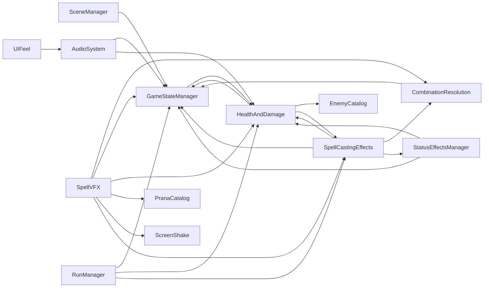

# Code Map

> Generated by `tools/code-map/code_map.py`. Do not edit by hand: re-run the script.
> Static text analysis of `src/` (comments and strings ignored), so treat counts as a
> guide, not a proof. Tests are not included.

## Summary

| Metric | Value |
|--------|-------|
| GDScript files | 176 |
| Lines | 36,411 |
| Autoloads | 14 |
| Files with `class_name` | 158 |
| Signals declared | 102 |
| Files over 800 lines | 11 |

## Autoloads

Who uses each global singleton. High "used by" means a change there ripples widely;
autoload-to-autoload arrows are hidden coupling between globals.

| Autoload | File | Lines | Used by (files) | Uses autoloads |
|----------|------|------:|----------------:|----------------|
| PranaCatalog | `data/prana_catalog.gd` | 243 | 12 | — |
| EnemyCatalog | `data/enemy_catalog.gd` | 268 | 6 | — |
| GameStateManager | `core/game_state_manager.gd` | 331 | 21 | HealthAndDamage |
| SceneManager | `core/scene_manager.gd` | 126 | 2 | GameStateManager |
| AudioSystem | `audio/audio_system.gd` | 1029 | 2 | GameStateManager, HealthAndDamage |
| HealthAndDamage | `systems/health_and_damage.gd` | 493 | 24 | EnemyCatalog, GameStateManager, SpellCastingEffects |
| StatusEffectsManager | `systems/status_effects_manager.gd` | 388 | 1 | GameStateManager, HealthAndDamage |
| CombinationResolution | `systems/combination_resolution.gd` | 811 | 6 | GameStateManager |
| SpellCastingEffects | `systems/spell_casting_effects.gd` | 1639 | 16 | CombinationResolution, GameStateManager, HealthAndDamage, StatusEffectsManager |
| SpellVFX | `ui/spell_vfx.gd` | 1161 | 2 | CombinationResolution, GameStateManager, HealthAndDamage, PranaCatalog, ScreenShake, SpellCastingEffects |
| RunManager | `systems/run_manager.gd` | 205 | 2 | GameStateManager, HealthAndDamage, SpellCastingEffects |
| InputPrompts | `core/input_prompts.gd` | 139 | 11 | — |
| UIFeel | `ui/ui_feel.gd` | 191 | 10 | AudioSystem |
| ScreenShake | `core/screen_shake.gd` | 99 | 2 | — |

### Cycles between autoloads

Autoloads that depend on each other, directly or through others. Each group has to
be loaded, tested and reasoned about together; break a cycle with a signal or by
passing the dependency in.

- CombinationResolution ↔ GameStateManager ↔ HealthAndDamage ↔ SpellCastingEffects ↔ StatusEffectsManager

## Large files (over 800 lines)

Refactor candidates. Fan-out = autoloads, classes and scripts this file depends on;
fan-in = files that depend on it. A large file with high fan-in is risky to split;
one with high fan-out is doing too many jobs.

| File | Lines | Fan-out | Fan-in | Signals declared |
|------|------:|--------:|-------:|-----------------:|
| `ui/combat_hud.gd` | 2053 | 25 | 4 | 0 |
| `systems/spell_casting_effects.gd` | 1639 | 14 | 16 | 15 |
| `scenes/debug_game_loop.gd` | 1623 | 65 | 0 | 0 |
| `gameplay/enemy_instance.gd` | 1598 | 28 | 1 | 2 |
| `scenes/isometric_room.gd` | 1324 | 18 | 4 | 0 |
| `ui/spell_vfx.gd` | 1161 | 17 | 2 | 0 |
| `gameplay/player_controller.gd` | 1144 | 22 | 3 | 11 |
| `audio/audio_system.gd` | 1029 | 7 | 2 | 0 |
| `ui/prana_grid.gd` | 1028 | 17 | 3 | 1 |
| `systems/wave_manager.gd` | 828 | 20 | 2 | 4 |
| `systems/combination_resolution.gd` | 811 | 10 | 7 | 2 |

## Most depended-on files (top 20 by fan-in)

| File | Fan-in | Lines |
|------|-------:|------:|
| `data/game_enums.gd` | 31 | 81 |
| `ui/ui_palette.gd` | 27 | 102 |
| `data/ui_copy.gd` | 25 | 773 |
| `systems/game_settings.gd` | 25 | 511 |
| `systems/health_and_damage.gd` | 24 | 493 |
| `core/game_state_manager.gd` | 21 | 331 |
| `systems/duo_swap.gd` | 19 | 298 |
| `systems/spell_casting_effects.gd` | 16 | 1639 |
| `audio/sfx.gd` | 13 | 28 |
| `data/bullet_pattern.gd` | 13 | 89 |
| `gameplay/projectile.gd` | 13 | 373 |
| `data/prana_catalog.gd` | 12 | 243 |
| `core/input_prompts.gd` | 11 | 139 |
| `ui/ui_feel.gd` | 10 | 191 |
| `data/dungeon_graph.gd` | 9 | 236 |
| `data/prana_type.gd` | 9 | 58 |
| `data/bullet_hell_tuning.gd` | 8 | 68 |
| `data/enemy_type.gd` | 8 | 47 |
| `data/hazard_spec.gd` | 8 | 75 |
| `data/spell_effect.gd` | 8 | 83 |

## Files with the most dependencies (top 20 by fan-out)

| File | Fan-out | Autoloads used | Lines |
|------|--------:|----------------|------:|
| `scenes/debug_game_loop.gd` | 65 | GameStateManager, HealthAndDamage, InputPrompts, PranaCatalog, RunManager, SceneManager, SpellCastingEffects | 1623 |
| `gameplay/enemy_instance.gd` | 28 | EnemyCatalog, GameStateManager, HealthAndDamage, PranaCatalog, SpellCastingEffects | 1598 |
| `ui/combat_hud.gd` | 25 | CombinationResolution, GameStateManager, HealthAndDamage, InputPrompts, PranaCatalog, RunManager, SpellCastingEffects | 2053 |
| `gameplay/player_controller.gd` | 22 | CombinationResolution, GameStateManager, HealthAndDamage, ScreenShake, SpellCastingEffects, SpellVFX | 1144 |
| `systems/wave_manager.gd` | 20 | EnemyCatalog, GameStateManager, HealthAndDamage, SpellCastingEffects | 828 |
| `scenes/isometric_room.gd` | 18 | — | 1324 |
| `scenes/main_menu.gd` | 18 | InputPrompts, UIFeel | 309 |
| `ui/prana_grid.gd` | 17 | CombinationResolution, GameStateManager, InputPrompts, PranaCatalog | 1028 |
| `ui/spell_vfx.gd` | 17 | CombinationResolution, GameStateManager, HealthAndDamage, PranaCatalog, ScreenShake, SpellCastingEffects | 1161 |
| `systems/spell_casting_effects.gd` | 14 | CombinationResolution, GameStateManager, HealthAndDamage, StatusEffectsManager | 1639 |
| `gameplay/hazards/stage_hazard.gd` | 10 | GameStateManager, HealthAndDamage | 133 |
| `systems/boss_director.gd` | 10 | — | 150 |
| `systems/combination_resolution.gd` | 10 | GameStateManager | 811 |
| `systems/pace_director.gd` | 10 | GameStateManager, HealthAndDamage, SpellCastingEffects, SpellVFX | 329 |
| `systems/tutorial/tutorial_room.gd` | 10 | HealthAndDamage, InputPrompts | 447 |
| `ui/pause_panel.gd` | 10 | InputPrompts, UIFeel | 338 |
| `ui/spellbook.gd` | 10 | CombinationResolution, EnemyCatalog, PranaCatalog | 150 |
| `gameplay/projectile.gd` | 9 | HealthAndDamage, SpellCastingEffects | 373 |
| `systems/sigil_effects.gd` | 9 | GameStateManager, HealthAndDamage, SpellCastingEffects | 311 |
| `systems/sigil_manager.gd` | 9 | HealthAndDamage, PranaCatalog, SpellCastingEffects | 402 |

## Signals

Signals declared in `src/`, where they are emitted and where they are connected
(`.connect()` in scripts or `[connection]` in `.tscn`). A signal name declared in more
than one file is marked ambiguous and left out of the checks below. A signal passed as a
value or named as `&"name"` counts as an indirect use and is also left out.

### Never connected in src (19)

Dead signals, or listened to only by tests or through a variable the scan cannot follow.

- `alerted` in `gameplay/enemy_instance.gd`
- `burn_contagion_triggered` in `systems/status_effects_manager.gd`
- `dash_charges_changed` in `gameplay/player_controller.gd`
- `destroyed` in `gameplay/cover_pillar.gd`
- `dissolved` in `visual/pixel_character.gd`
- `echo_strike_fired` in `systems/combination_resolution.gd`
- `layer_generated` in `systems/dungeon_generator.gd`
- `link_severed` in `gameplay/player_controller.gd`
- `loadout_changed` in `systems/prana_loadout.gd`
- `offer_finished` in `systems/sigil_manager.gd`
- `perfect_swapped` in `gameplay/player_controller.gd`
- `phase_applied` in `systems/boss_director.gd`
- `played` in `systems/room_clear_moment.gd`
- `relink_progress` in `gameplay/player_controller.gd`
- `rerolled` in `systems/sigil_manager.gd`
- `room_changed` in `core/scene_manager.gd`
- `shatter_triggered` in `systems/status_effects_manager.gd`
- `status_applied` in `systems/status_effects_manager.gd`
- `status_expired` in `systems/status_effects_manager.gd`

### Never emitted (1)

Declared but no `.emit()` found: dead, or emitted through a path the scan cannot follow.

- `grid_hidden` in `core/game_state_manager.gd`

All signals

| Signal | Declared in | Emitted in | Connected in | Indirect use in |
|--------|-------------|------------|--------------|-----------------|
| `alerted` | `gameplay/enemy_instance.gd` | gameplay/enemy_instance.gd | — | — |
| `all_waves_cleared` | `systems/wave_manager.gd` | systems/wave_manager.gd | systems/wave_manager.gd | — |
| `arrangement_confirmed` | `ui/prana_grid.gd` | ui/prana_grid.gd | ui/prana_grid.gd | — |
| `bag_changed` | `systems/prana_bag.gd` | systems/prana_bag.gd | scenes/debug_game_loop.gd | — |
| `boss_defeated` | `systems/wave_manager.gd` | systems/wave_manager.gd | systems/wave_manager.gd | — |
| `boss_spawned` | `systems/wave_manager.gd` | systems/wave_manager.gd | scenes/debug_game_loop.gd | — |
| `brother_tagged_in` | `systems/spell_casting_effects.gd` | systems/spell_casting_effects.gd | systems/sigil_effects.gd | — |
| `burn_contagion_triggered` | `systems/status_effects_manager.gd` | systems/status_effects_manager.gd | — | — |
| `cascade_burst` | `systems/spell_casting_effects.gd` | systems/spell_casting_effects.gd | ui/spell_vfx.gd, visual/floor_lighting.gd | visual/floor_lighting.gd |
| `cast_hit_started` | `systems/spell_casting_effects.gd` | systems/spell_casting_effects.gd | gameplay/player_controller.gd, ui/combat_hud.gd, ui/spell_vfx.gd | — |
| `cast_started` | `systems/spell_casting_effects.gd` | systems/spell_casting_effects.gd | scenes/debug_game_loop.gd, ui/spell_vfx.gd, visual/floor_lighting.gd | visual/floor_lighting.gd |
| `chain_index_changed` | `systems/spell_casting_effects.gd` | systems/spell_casting_effects.gd | systems/run_manager.gd, ui/combat_hud.gd, ui/spell_vfx.gd | — |
| `character_swapped` | `gameplay/player_controller.gd` | gameplay/player_controller.gd | scenes/debug_game_loop.gd | systems/pace_director.gd |
| `closed` (ambiguous) | `ui/heirloom_screen.gd` | ui/heirloom_screen.gd | — | — |
| `closed` (ambiguous) | `ui/memories_panel.gd` | ui/memories_panel.gd | — | — |
| `closed` (ambiguous) | `ui/memory_fragment_modal.gd` | ui/memory_fragment_modal.gd | — | — |
| `closed` (ambiguous) | `ui/settings_panel.gd` | ui/settings_panel.gd | — | — |
| `closed` (ambiguous) | `ui/spellbook_panel.gd` | ui/spellbook_panel.gd | — | — |
| `closed` (ambiguous) | `ui/wayshrine_panel.gd` | ui/wayshrine_panel.gd | — | — |
| `combat_started` | `core/game_state_manager.gd` | core/game_state_manager.gd | audio/audio_system.gd, gameplay/enemy_instance.gd, gameplay/hazards/stage_hazard.gd, gameplay/player_controller.gd, scenes/debug_game_loop.gd, systems/combination_resolution.gd, systems/pace_director.gd, systems/room_clear_moment.gd, systems/spell_casting_effects.gd, systems/wave_manager.gd, ui/combat_hud.gd | — |
| `combo_resolved` | `systems/combination_resolution.gd` | systems/combination_resolution.gd | gameplay/player_controller.gd, systems/spell_casting_effects.gd, ui/combat_hud.gd, ui/spell_vfx.gd | — |
| `combo_window_opened` | `systems/spell_casting_effects.gd` | systems/spell_casting_effects.gd | ui/spell_vfx.gd | — |
| `completed` | `ui/tutorial_coach.gd` | ui/tutorial_coach.gd | scenes/debug_game_loop.gd | — |
| `damage_taken` | `systems/health_and_damage.gd` | systems/health_and_damage.gd | gameplay/dummy_enemy.gd, gameplay/enemy_instance.gd, gameplay/player_controller.gd, scenes/debug_game_loop.gd, systems/pace_director.gd, ui/combat_hud.gd, ui/spell_vfx.gd | — |
| `dash_blocked` | `gameplay/player_controller.gd` | gameplay/player_controller.gd | ui/combat_hud.gd | — |
| `dash_charges_changed` | `gameplay/player_controller.gd` | gameplay/player_controller.gd | — | — |
| `dash_cooldown_changed` | `gameplay/player_controller.gd` | gameplay/player_controller.gd | ui/combat_hud.gd | — |
| `death_started` | `core/game_state_manager.gd` | core/game_state_manager.gd | audio/audio_system.gd, gameplay/hazards/stage_hazard.gd | — |
| `destroyed` | `gameplay/cover_pillar.gd` | gameplay/cover_pillar.gd | — | — |
| `device_changed` | `core/input_prompts.gd` | core/input_prompts.gd | scenes/debug_game_loop.gd, scenes/main_menu.gd, systems/tutorial/tutorial_room.gd, ui/combat_hud.gd, ui/prana_grid.gd, ui/tutorial_coach.gd | — |
| `dissolved` | `visual/pixel_character.gd` | visual/pixel_character.gd | — | — |
| `dummy_killed` | `gameplay/dummy_enemy.gd` | gameplay/dummy_enemy.gd | scenes/training_room.gd, systems/tutorial/tutorial_room.gd | — |
| `duo_counted` | `systems/pace_director.gd` | systems/pace_director.gd | scenes/debug_game_loop.gd | — |
| `duo_foe_hit` | `systems/health_and_damage.gd` | systems/health_and_damage.gd | ui/combat_hud.gd | — |
| `echo_strike_fired` | `systems/combination_resolution.gd` | systems/combination_resolution.gd | — | — |
| `effect_fired` | `systems/sigil_effects.gd` | systems/sigil_effects.gd | scenes/debug_game_loop.gd | — |
| `enemy_killed` | `systems/health_and_damage.gd` | systems/health_and_damage.gd | gameplay/dummy_enemy.gd, gameplay/enemy_instance.gd, scenes/debug_game_loop.gd, systems/boss_death_cinematic.gd, systems/pace_director.gd, systems/room_clear_moment.gd, systems/run_manager.gd, systems/sigil_effects.gd, systems/status_effects_manager.gd, systems/wave_manager.gd, ui/combat_hud.gd | — |
| `face_changed` | `systems/spell_casting_effects.gd` | systems/spell_casting_effects.gd | ui/combat_hud.gd | — |
| `finished` (ambiguous) | `systems/boss_death_cinematic.gd` | systems/boss_death_cinematic.gd | — | — |
| `finished` (ambiguous) | `systems/tutorial/tutorial_room.gd` | systems/tutorial/tutorial_room.gd | — | — |
| `floor_completed` | `core/game_state_manager.gd` | core/game_state_manager.gd, scenes/debug_game_loop.gd | scenes/debug_game_loop.gd, systems/run_manager.gd | — |
| `game_paused` | `core/game_state_manager.gd` | core/game_state_manager.gd | audio/audio_system.gd, scenes/debug_game_loop.gd | — |
| `game_resumed` | `core/game_state_manager.gd` | core/game_state_manager.gd | audio/audio_system.gd, scenes/debug_game_loop.gd | — |
| `grazed` | `systems/spell_casting_effects.gd` | systems/spell_casting_effects.gd | gameplay/player_controller.gd, systems/pace_director.gd, systems/sigil_effects.gd, ui/spell_vfx.gd | — |
| `grid_hidden` | `core/game_state_manager.gd` | — | ui/prana_grid.gd | — |
| `grid_locked` | `core/game_state_manager.gd` | core/game_state_manager.gd | ui/prana_grid.gd | — |
| `health_restored` | `systems/health_and_damage.gd` | systems/health_and_damage.gd | ui/combat_hud.gd, ui/spell_vfx.gd | — |
| `heartbeat` | `gameplay/player_controller.gd` | gameplay/player_controller.gd | scenes/debug_game_loop.gd | — |
| `heavy_hit` | `systems/health_and_damage.gd` | systems/health_and_damage.gd | gameplay/player_controller.gd, scenes/debug_game_loop.gd, ui/spell_vfx.gd | — |
| `layer_generated` | `systems/dungeon_generator.gd` | systems/dungeon_generator.gd | — | — |
| `layout_changed` | `ui/sigil_strip.gd` | ui/sigil_strip.gd | ui/combat_hud.gd | — |
| `link_burst` | `systems/spell_casting_effects.gd` | systems/spell_casting_effects.gd | gameplay/player_controller.gd, scenes/debug_game_loop.gd, systems/pace_director.gd, ui/combat_hud.gd | — |
| `link_reaction` | `systems/spell_casting_effects.gd` | systems/spell_casting_effects.gd | scenes/debug_game_loop.gd, systems/pace_director.gd, ui/combat_hud.gd | — |
| `link_severed` | `gameplay/player_controller.gd` | gameplay/player_controller.gd | — | — |
| `loadout_changed` | `systems/prana_loadout.gd` | systems/prana_loadout.gd | — | — |
| `main_menu_pressed` (ambiguous) | `ui/pause_panel.gd` | — | — | ui/pause_panel.gd |
| `main_menu_pressed` (ambiguous) | `ui/run_summary_panel.gd` | ui/run_summary_panel.gd | — | — |
| `memory_fragment_triggered` | `scenes/anchor_object_node.gd` | scenes/anchor_object_node.gd | scenes/isometric_room.gd | — |
| `offer_finished` | `systems/sigil_manager.gd` | systems/sigil_manager.gd | — | — |
| `palette_changed` | `data/prana_catalog.gd` | data/prana_catalog.gd | ui/prana_grid.gd, ui/title_glow.gd | — |
| `perfect_cast` | `systems/spell_casting_effects.gd` | systems/spell_casting_effects.gd | scenes/debug_game_loop.gd, systems/pace_director.gd, systems/sigil_effects.gd, systems/wave_manager.gd, ui/spell_vfx.gd | ui/tutorial_coach.gd |
| `perfect_dodge_triggered` | `systems/pace_director.gd` | systems/pace_director.gd | scenes/debug_game_loop.gd | — |
| `perfect_dodged` | `gameplay/player_controller.gd` | gameplay/player_controller.gd | — | systems/pace_director.gd |
| `perfect_swapped` | `gameplay/player_controller.gd` | gameplay/player_controller.gd | — | — |
| `phase_applied` | `systems/boss_director.gd` | systems/boss_director.gd | — | — |
| `phase_changed` | `gameplay/enemy_instance.gd` | gameplay/enemy_instance.gd | systems/boss_director.gd, ui/combat_hud.gd | systems/boss_director.gd, ui/combat_hud.gd |
| `played` | `systems/room_clear_moment.gd` | systems/room_clear_moment.gd | — | — |
| `player_died` | `systems/health_and_damage.gd` | systems/health_and_damage.gd | core/game_state_manager.gd, gameplay/player_controller.gd, ui/combat_hud.gd, ui/spell_vfx.gd | — |
| `player_entered` | `ui/room_exit_door.gd` | ui/room_exit_door.gd | systems/room_transition_manager.gd | — |
| `player_hp_zone_changed` | `systems/health_and_damage.gd` | systems/health_and_damage.gd | audio/audio_system.gd, ui/combat_hud.gd, ui/spell_vfx.gd | — |
| `preparation_started` | `core/game_state_manager.gd` | core/game_state_manager.gd | audio/audio_system.gd, gameplay/enemy_instance.gd, gameplay/hazards/stage_hazard.gd, gameplay/player_controller.gd, systems/combination_resolution.gd, systems/pace_director.gd, systems/spell_casting_effects.gd, systems/status_effects_manager.gd, systems/wave_manager.gd, ui/combat_hud.gd, ui/prana_grid.gd, ui/spell_vfx.gd | — |
| `progress_changed` | `ui/heirloom_screen.gd` | ui/heirloom_screen.gd | scenes/main_menu.gd | — |
| `quit_pressed` | `ui/pause_panel.gd` | — | scenes/debug_game_loop.gd | ui/pause_panel.gd |
| `reaction_triggered` | `systems/spell_casting_effects.gd` | systems/spell_casting_effects.gd | ui/spell_vfx.gd | — |
| `relink_progress` | `gameplay/player_controller.gd` | gameplay/player_controller.gd | — | — |
| `relinked` | `gameplay/player_controller.gd` | gameplay/player_controller.gd | ui/combat_hud.gd | — |
| `rerolled` | `systems/sigil_manager.gd` | systems/sigil_manager.gd | — | — |
| `resonated` | `gameplay/player_controller.gd` | gameplay/player_controller.gd | scenes/debug_game_loop.gd, ui/combat_hud.gd | systems/pace_director.gd |
| `restart_pressed` | `ui/pause_panel.gd` | — | scenes/debug_game_loop.gd | ui/pause_panel.gd |
| `resume_pressed` | `ui/pause_panel.gd` | — | scenes/debug_game_loop.gd | ui/pause_panel.gd |
| `room_changed` | `core/scene_manager.gd` | core/scene_manager.gd | — | — |
| `room_cleared` | `core/game_state_manager.gd` | core/game_state_manager.gd | gameplay/hazards/stage_hazard.gd, gameplay/player_controller.gd, scenes/debug_game_loop.gd, systems/pace_director.gd, systems/room_clear_moment.gd, systems/run_manager.gd, ui/room_exit_door.gd | — |
| `room_ranked` | `systems/pace_director.gd` | systems/pace_director.gd | scenes/debug_game_loop.gd | — |
| `room_transition_completed` | `systems/room_transition_manager.gd` | systems/room_transition_manager.gd | scenes/debug_game_loop.gd | — |
| `run_again_pressed` | `ui/run_summary_panel.gd` | ui/run_summary_panel.gd | scenes/debug_game_loop.gd | — |
| `run_ended` | `core/game_state_manager.gd` | core/game_state_manager.gd | audio/audio_system.gd, scenes/debug_game_loop.gd, scenes/training_room.gd, systems/run_manager.gd | — |
| `run_started` | `core/game_state_manager.gd` | core/game_state_manager.gd | audio/audio_system.gd, systems/health_and_damage.gd, systems/pace_director.gd, systems/prana_bag.gd, systems/run_manager.gd, systems/sigil_effects.gd, systems/spell_casting_effects.gd, ui/combat_hud.gd | — |
| `settings_pressed` | `ui/pause_panel.gd` | — | scenes/debug_game_loop.gd | ui/pause_panel.gd |
| `shatter_triggered` | `systems/status_effects_manager.gd` | systems/status_effects_manager.gd | — | — |
| `sigil_applied` | `systems/sigil_manager.gd` | systems/sigil_manager.gd | scenes/debug_game_loop.gd | — |
| `special_fired` | `systems/spell_casting_effects.gd` | systems/spell_casting_effects.gd | scenes/debug_game_loop.gd, systems/sigil_effects.gd, systems/wave_manager.gd, ui/spell_vfx.gd, visual/floor_lighting.gd | visual/floor_lighting.gd |
| `special_meter_changed` | `systems/spell_casting_effects.gd` | systems/spell_casting_effects.gd | ui/combat_hud.gd, ui/spell_vfx.gd | — |
| `spell_hit_element` | `systems/spell_casting_effects.gd` | systems/spell_casting_effects.gd | gameplay/player_controller.gd, systems/pace_director.gd, ui/combat_hud.gd, ui/spell_vfx.gd, visual/floor_lighting.gd | visual/floor_lighting.gd |
| `spellbook_pressed` | `ui/pause_panel.gd` | — | scenes/debug_game_loop.gd | ui/pause_panel.gd |
| `state_changed` | `core/game_state_manager.gd` | core/game_state_manager.gd | core/scene_manager.gd | — |
| `status_applied` | `systems/status_effects_manager.gd` | systems/status_effects_manager.gd | — | — |
| `status_expired` | `systems/status_effects_manager.gd` | systems/status_effects_manager.gd | — | — |
| `style_changed` | `systems/pace_director.gd` | systems/pace_director.gd | scenes/debug_game_loop.gd | — |
| `trade_chosen` | `ui/wayshrine_panel.gd` | ui/wayshrine_panel.gd | scenes/debug_game_loop.gd | — |
| `tutorial_pressed` | `ui/pause_panel.gd` | — | scenes/debug_game_loop.gd | ui/pause_panel.gd |
| `wave_cleared` | `systems/wave_manager.gd` | systems/wave_manager.gd | systems/wave_manager.gd | — |
| `wave_ended` | `core/game_state_manager.gd` | core/game_state_manager.gd | gameplay/hazards/stage_hazard.gd, scenes/debug_game_loop.gd, systems/run_manager.gd | — |

## Per-file dependencies

Every file

| File | Lines | Autoloads | Classes | Loads |
|------|------:|-----------|---------|-------|
| `audio/audio_event_data.gd` | 29 | — | — | — |
| `audio/audio_event_registry.gd` | 12 | — | AudioEventData | — |
| `audio/audio_system.gd` | 1029 | GameStateManager, HealthAndDamage | AudioEventData, AudioEventRegistry, AudioFilterTuning, GameEnums, MusicPlaylist | — |
| `audio/duo_music.gd` | 142 | — | DuoSwap, DuoTuning | — |
| `audio/sfx.gd` | 28 | — | — | — |
| `characters/iso_character.gd` | 203 | — | — | — |
| `core/deferred_warp.gd` | 60 | — | TimeWarp | — |
| `core/game_state_manager.gd` | 331 | HealthAndDamage | GameEnums | — |
| `core/input_prompts.gd` | 139 | — | UICopy | — |
| `core/rumble.gd` | 55 | — | GameSettings, RumbleTuning | — |
| `core/scene_manager.gd` | 126 | GameStateManager | — | — |
| `core/screen_shake.gd` | 99 | — | GameSettings, ShakeState | — |
| `core/shake_hook.gd` | 33 | — | — | — |
| `core/shake_state.gd` | 85 | — | ShakeTuning | — |
| `core/time_warp.gd` | 38 | — | GameSettings | — |
| `data/adjacency_effect.gd` | 22 | — | — | — |
| `data/anchor_object.gd` | 41 | — | — | — |
| `data/ascension_config.gd` | 57 | — | AscensionLevel, EnemyPoolConfig | — |
| `data/ascension_level.gd` | 25 | — | — | — |
| `data/attack_tuning.gd` | 116 | — | — | — |
| `data/audio_filter_tuning.gd` | 43 | — | — | — |
| `data/big_moment_tuning.gd` | 58 | — | — | — |
| `data/boss_phase_event.gd` | 17 | — | HazardSpec | — |
| `data/boss_profile.gd` | 41 | — | BossPhaseEvent, BossVariant | — |
| `data/boss_roster.gd` | 40 | — | BossProfile, BossVariant | — |
| `data/boss_variant.gd` | 29 | — | BossPhaseEvent, BulletPattern | — |
| `data/bullet_hell_tuning.gd` | 68 | — | BulletPattern | — |
| `data/bullet_pattern.gd` | 89 | — | EnemyBulletPalette | — |
| `data/camera_tuning.gd` | 45 | — | — | — |
| `data/cascade_effect.gd` | 27 | — | — | — |
| `data/character_fx_tuning.gd` | 67 | — | — | — |
| `data/core_frame.gd` | 65 | — | DuoSwap, SigilManager | — |
| `data/core_roster.gd` | 22 | — | CoreFrame | — |
| `data/dungeon_graph.gd` | 236 | — | RoomModifiers, RoomTemplate | — |
| `data/duo_tuning.gd` | 149 | — | — | — |
| `data/enemy_awareness_tuning.gd` | 27 | — | — | — |
| `data/enemy_bullet_palette.gd` | 37 | — | — | — |
| `data/enemy_catalog.gd` | 268 | — | EnemyType, GameEnums | — |
| `data/enemy_pool_config.gd` | 71 | — | — | — |
| `data/enemy_type.gd` | 47 | — | BulletPattern, GameEnums | — |
| `data/feedback_config.gd` | 14 | — | — | — |
| `data/floor_lighting_tuning.gd` | 57 | — | — | — |
| `data/floor_theme.gd` | 61 | — | RoomLook, RoomSelector, RoomTemplate | — |
| `data/game_enums.gd` | 81 | — | — | — |
| `data/hands_tuning.gd` | 21 | — | — | — |
| `data/hazard_spec.gd` | 75 | — | BulletPattern | — |
| `data/hud_juice_tuning.gd` | 45 | — | — | — |
| `data/hud_readout_tuning.gd` | 29 | — | — | — |
| `data/hud_toast_tuning.gd` | 24 | — | — | — |
| `data/memory_fragment.gd` | 22 | — | — | — |
| `data/meta_tuning.gd` | 77 | — | AscensionConfig | — |
| `data/music_playlist.gd` | 37 | — | — | — |
| `data/neighbor_condition.gd` | 24 | — | — | — |
| `data/non_primary_modifier.gd` | 46 | — | — | — |
| `data/obstacle_config.gd` | 49 | — | — | — |
| `data/pace_tuning.gd` | 104 | — | — | — |
| `data/prana_catalog.gd` | 243 | — | GameSettings, PranaPalette, PranaType | — |
| `data/prana_fragment.gd` | 32 | — | — | — |
| `data/prana_palette.gd` | 25 | — | — | — |
| `data/prana_type.gd` | 58 | — | GameEnums | — |
| `data/reaction_def.gd` | 43 | — | GameEnums | — |
| `data/reaction_tuning.gd` | 49 | — | — | — |
| `data/room_look.gd` | 82 | — | — | — |
| `data/room_modifier_tuning.gd` | 42 | — | — | — |
| `data/room_template.gd` | 80 | — | HazardSpec, ObstacleConfig | — |
| `data/rumble_tuning.gd` | 30 | — | — | — |
| `data/shake_tuning.gd` | 59 | — | — | — |
| `data/sigil_config.gd` | 139 | — | — | — |
| `data/spawn_glyph_tuning.gd` | 44 | — | — | — |
| `data/spell_effect.gd` | 83 | — | CascadeEffect | — |
| `data/story_config.gd` | 38 | — | MemoryFragment | — |
| `data/tutorial_room_tuning.gd` | 55 | — | — | — |
| `data/ui_copy.gd` | 773 | — | — | — |
| `gameplay/bullet_pattern_runner.gd` | 121 | — | BulletPattern | — |
| `gameplay/bullet_pool.gd` | 70 | — | Projectile | — |
| `gameplay/cover_pillar.gd` | 243 | — | Sfx | — |
| `gameplay/dummy_enemy.gd` | 173 | EnemyCatalog, HealthAndDamage | EnemyType, GameEnums, KnockbackMotion | scenes/debug_circle_2d.gd |
| `gameplay/enemy_instance.gd` | 1598 | EnemyCatalog, GameStateManager, HealthAndDamage, PranaCatalog, SpellCastingEffects | BigMomentTuning, BossVariant, BulletHellTuning, BulletPattern, BulletPatternRunner, BulletPool, CharacterFxTuning, DeathRecap, DuoFoe, DuoSwap, EnemyAwarenessTuning, EnemyLaser, EnemyType, GameEnums, IsoCharacter, KnockbackMotion, MortarShell, PixelCharacter, PixelVFX, PranaType, Projectile, Sfx, ShakeState | — |
| `gameplay/enemy_laser.gd` | 137 | HealthAndDamage, SpellCastingEffects | BulletHellTuning, BulletPattern, CoverPillar, GameEnums, Projectile, Sfx | — |
| `gameplay/hazards/hazard_closing_ring.gd` | 61 | — | HazardSpec, StageHazard | — |
| `gameplay/hazards/hazard_floor_zone.gd` | 74 | — | CoverPillar, HazardSpec, Sfx, StageHazard | — |
| `gameplay/hazards/hazard_sweep_laser.gd` | 118 | SpellCastingEffects | CoverPillar, Projectile, Sfx, StageHazard | — |
| `gameplay/hazards/hazard_turret.gd` | 97 | — | BulletPattern, BulletPatternRunner, BulletPool, CoverPillar, DeathRecap, Projectile, Sfx, StageHazard | — |
| `gameplay/hazards/stage_hazard.gd` | 133 | GameStateManager, HealthAndDamage | BulletHellTuning, DeathRecap, GameEnums, HazardClosingRing, HazardFloorZone, HazardSpec, HazardSweepLaser, HazardTurret | — |
| `gameplay/knockback_motion.gd` | 40 | — | — | — |
| `gameplay/mortar_shell.gd` | 104 | HealthAndDamage, SpellCastingEffects | BulletHellTuning, BulletPattern, BulletPool, GameEnums, Projectile, Sfx | — |
| `gameplay/pickup_orb.gd` | 176 | HealthAndDamage, SpellCastingEffects | BigMomentTuning, PaceTuning, Sfx | — |
| `gameplay/player_controller.gd` | 1144 | CombinationResolution, GameStateManager, HealthAndDamage, ScreenShake, SpellCastingEffects, SpellVFX | BulletHellTuning, CameraTuning, CharacterFxTuning, DuoLooks, DuoSwap, DuoTuning, GameEnums, IsoCharacter, PaceTuning, PixelCharacter, PixelVFX, Projectile, Rumble, Sfx, ShakeState, SpellEffect | — |
| `gameplay/projectile.gd` | 373 | HealthAndDamage, SpellCastingEffects | BulletArt, BulletHellTuning, BulletPattern, CoverPillar, EnemyBulletPalette, GameEnums, GameSettings | — |
| `gameplay/tutorial_turret.gd` | 84 | — | BulletPattern, Projectile, TutorialRoomTuning, UIPalette | — |
| `scenes/anchor_object_node.gd` | 81 | — | AnchorObject | — |
| `scenes/debug_circle_2d.gd` | 111 | — | PixelVFX | — |
| `scenes/debug_game_loop.gd` | 1623 | GameStateManager, HealthAndDamage, InputPrompts, PranaCatalog, RunManager, SceneManager, SpellCastingEffects | AscensionLevel, BossDeathCinematic, BossDirector, CombatHUD, CoreFrame, CoreRoster, CrumplePose, DeathRecap, DungeonGenerator, DungeonGraph, DuoMusic, DuoSwap, EnemyPoolConfig, FloorTheme, GameEnums, GameSettings, HudJuiceTuning, HudToaster, IsometricRoom, MemoryFragmentModal, MetaProgress, MetaTuning, OffscreenIndicators, PaceDirector, PathBuilder, PausePanel, PixelCharacter, PlayerController, PranaBag, PranaGrid, PranaIcon, PranaLoadout, PranaTypeToken, Records, RoomClearMoment, RoomModifiers, RoomTransitionManager, Rumble, RunLog, RunSave, RunSummaryPanel, RunTimerLabel, SettingsPanel, SigilEffects, SigilManager, SigilStrip, SpellEffect, Spellbook, SpellbookPanel, StoryRules, TitleGlow, TutorialCoach, TutorialRoom, TutorialRoomPanel, UICopy, UIPalette, WaveManager, WayshrinePanel | — |
| `scenes/isometric_room.gd` | 1324 | — | AnchorObject, AnchorObjectNode, CoverPillar, FloorLighting, FloorTheme, FloorTileAtlas, HazardClosingRing, HazardSpec, MemoryFragmentModal, ObstacleConfig, PropArt, QuadBatch, RoomBackdrop, RoomDecor, RoomExitDoor, RoomLook, RoomTemplate, StageHazard | — |
| `scenes/main_menu.gd` | 309 | InputPrompts, UIFeel | FeedbackLink, GameSettings, HeirloomScreen, MemoriesPanel, MenuBackdrop, MetaProgress, MetaTuning, Records, RunSave, SettingsPanel, Spellbook, SpellbookPanel, StoryRules, TitleGlow, UICopy, UIPalette | — |
| `scenes/training_room.gd` | 169 | GameStateManager, HealthAndDamage | CombatHUD, DummyEnemy, GameSettings, IsometricRoom, PlayerController | — |
| `systems/boss_death_cinematic.gd` | 261 | HealthAndDamage | BigMomentTuning, DeferredWarp, GameEnums, GameSettings, ShakeHook | — |
| `systems/boss_director.gd` | 150 | — | BossPhaseEvent, BossProfile, BossRoster, BossVariant, CombatHUD, HazardClosingRing, HazardSpec, Projectile, StageHazard, UICopy | — |
| `systems/combination_resolution.gd` | 811 | GameStateManager | CascadeEffect, DuoSwap, NeighborCondition, NonPrimaryModifier, PranaFragment, PranaHands, PranaType, ReactionDef, SpellEffect | — |
| `systems/death_recap.gd` | 101 | — | BulletPattern, HazardSpec, Spellbook, UICopy | — |
| `systems/dungeon_generator.gd` | 56 | — | DungeonGraph, FloorTheme, PathBuilder, RoomSelector | — |
| `systems/duo_foe.gd` | 46 | — | DuoSwap, DuoTuning | — |
| `systems/duo_swap.gd` | 298 | — | DuoTuning | — |
| `systems/enemy_hp_instance.gd` | 34 | — | GameEnums | — |
| `systems/game_settings.gd` | 511 | — | PranaPalette | — |
| `systems/health_and_damage.gd` | 493 | EnemyCatalog, GameStateManager, SpellCastingEffects | EnemyHPInstance, EnemyType, GameEnums | — |
| `systems/meta_progress.gd` | 362 | — | EnemyPoolConfig, MetaTuning, SigilConfig | — |
| `systems/pace_director.gd` | 329 | GameStateManager, HealthAndDamage, SpellCastingEffects, SpellVFX | GameEnums, PaceTuning, PickupOrb, Sfx, StyleMeter, TimeWarp | — |
| `systems/path_builder.gd` | 237 | — | DungeonGraph | — |
| `systems/prana_bag.gd` | 80 | GameStateManager | — | — |
| `systems/prana_hands.gd` | 49 | — | HandsTuning | — |
| `systems/prana_loadout.gd` | 84 | — | — | — |
| `systems/room_clear_moment.gd` | 114 | GameStateManager, HealthAndDamage | BigMomentTuning, ClearBanner, DeferredWarp, DungeonGraph, GameEnums, WaveManager | — |
| `systems/room_modifiers.gd` | 94 | — | DungeonGraph, EnemyPoolConfig, RoomModifierTuning | — |
| `systems/room_selector.gd` | 200 | — | DungeonGraph, RoomTemplate | — |
| `systems/room_transition_manager.gd` | 229 | SceneManager | DungeonGraph, FloorTheme, IsometricRoom, RoomExitDoor, RoomModifiers, RoomTemplate | — |
| `systems/run_log.gd` | 128 | PranaCatalog | PaceDirector, PranaType, Spellbook | — |
| `systems/run_manager.gd` | 205 | GameStateManager, HealthAndDamage, SpellCastingEffects | GameEnums | — |
| `systems/run_save.gd` | 95 | — | PranaLoadout | — |
| `systems/sigil_effects.gd` | 311 | GameStateManager, HealthAndDamage, SpellCastingEffects | DuoSwap, GameEnums, PixelVFX, Projectile, Sfx, SigilConfig | — |
| `systems/sigil_manager.gd` | 402 | HealthAndDamage, PranaCatalog, SpellCastingEffects | PranaIcon, PranaType, SigilConfig, SigilEffects, UICopy, UIPalette | — |
| `systems/spell_casting_effects.gd` | 1639 | CombinationResolution, GameStateManager, HealthAndDamage, StatusEffectsManager | AttackTuning, BulletHellTuning, CascadeEffect, DuoSwap, DuoTuning, GameEnums, NonPrimaryModifier, ReactionDef, ReactionTuning, SpellEffect | — |
| `systems/status_effects_manager.gd` | 388 | GameStateManager, HealthAndDamage | GameEnums | — |
| `systems/story_rules.gd` | 68 | — | MemoryFragment, StoryConfig | — |
| `systems/style_meter.gd` | 115 | — | PaceTuning | — |
| `systems/tutorial/tutorial_room.gd` | 447 | HealthAndDamage, InputPrompts | DummyEnemy, DuoSwap, GameEnums, Sfx, TutorialRoomPanel, TutorialRoomTuning, TutorialTurret, UICopy | — |
| `systems/wave_manager.gd` | 828 | EnemyCatalog, GameStateManager, HealthAndDamage, SpellCastingEffects | BossVariant, BulletHellTuning, DungeonGraph, DuoFoe, EnemyInstance, EnemyPoolConfig, EnemyType, FloorLighting, GameEnums, GameSettings, PaceTuning, Projectile, ShakeState, SpawnGlyph, SpawnGlyphTuning, ThreatIcon | — |
| `ui/boss_health_bar.gd` | 153 | — | HudReadoutTuning, UIPalette | — |
| `ui/clear_banner.gd` | 96 | — | BigMomentTuning, GameSettings, UICopy, UIPalette | — |
| `ui/combat_hud.gd` | 2053 | CombinationResolution, GameStateManager, HealthAndDamage, InputPrompts, PranaCatalog, RunManager, SpellCastingEffects | BossHealthBar, BossVariant, CascadeEffect, DashRing, DuoPortraits, DuoSwap, FloorMap, GameEnums, GameSettings, HudJuiceTuning, PlayerController, PranaType, ReactionDef, RoomModifiers, SigilStrip, SpellEffect, UICopy, UIPalette | — |
| `ui/dash_ring.gd` | 64 | — | — | — |
| `ui/duo_portraits.gd` | 114 | — | DuoLooks, DuoSwap | — |
| `ui/feedback_link.gd` | 36 | — | FeedbackConfig | — |
| `ui/floor_map.gd` | 190 | — | UIPalette | — |
| `ui/heirloom_screen.gd` | 184 | InputPrompts, UIFeel | MetaProgress, MetaTuning, UICopy, UIPalette | — |
| `ui/hud_toaster.gd` | 177 | — | GameSettings, HudToastTuning, UIPalette | — |
| `ui/memories_panel.gd` | 195 | UIFeel | MemoryFragment, MetaProgress, StoryConfig, StoryRules, UICopy, UIPalette | — |
| `ui/memory_fragment_modal.gd` | 230 | UIFeel | GameSettings, MemoryFragment, StoryRules, UICopy, UIPalette | — |
| `ui/menu_backdrop.gd` | 190 | — | DuoLooks, DuoSwap, UIPalette | — |
| `ui/offscreen_indicators.gd` | 125 | — | GameEnums | — |
| `ui/pause_panel.gd` | 338 | InputPrompts, UIFeel | DuoSwap, FloorMap, PranaGridSlot, PranaIcon, SpellPreview, ThreatIcon, UICopy, UIPalette | — |
| `ui/prana_grid.gd` | 1028 | CombinationResolution, GameStateManager, InputPrompts, PranaCatalog | CascadeEffect, DuoSwap, PaceTuning, PranaFragment, PranaGridFrame, PranaGridSlot, PranaHands, PranaType, PranaTypeToken, ReactionDef, SpellPreview, UICopy, UIPalette | — |
| `ui/prana_grid_frame.gd` | 78 | — | PranaTypeToken, UIPalette | — |
| `ui/prana_grid_slot.gd` | 200 | — | DuoSwap, PranaGrid, PranaIcon, PranaTypeToken, UIPalette | — |
| `ui/prana_icon.gd` | 76 | PranaCatalog | — | — |
| `ui/prana_type_token.gd` | 108 | PranaCatalog | PranaGrid, PranaGridSlot, PranaIcon, UICopy | — |
| `ui/records.gd` | 55 | EnemyCatalog | EnemyType, GameEnums, MetaProgress, RunSummaryPanel, Spellbook, UICopy | — |
| `ui/room_exit_door.gd` | 269 | GameStateManager | BigMomentTuning, DungeonGraph, GameSettings, RoomModifiers, UICopy | — |
| `ui/run_summary_panel.gd` | 261 | InputPrompts, UIFeel | CrumplePose, DuoSwap, FeedbackLink, GameSettings, HudJuiceTuning, UICopy, UIPalette | — |
| `ui/run_timer_label.gd` | 64 | — | GameSettings, RunSummaryPanel, UIPalette | — |
| `ui/settings_panel.gd` | 529 | AudioSystem, InputPrompts, PranaCatalog, UIFeel | CombatHUD, GameSettings, UICopy, UIPalette | — |
| `ui/sigil_strip.gd` | 177 | — | HudReadoutTuning, SigilConfig, UIPalette | — |
| `ui/spell_preview.gd` | 173 | — | CascadeEffect, DuoSwap, PranaHands, ReactionDef, UICopy, UIPalette | systems/combination_resolution.gd |
| `ui/spell_vfx.gd` | 1161 | CombinationResolution, GameStateManager, HealthAndDamage, PranaCatalog, ScreenShake, SpellCastingEffects | AttackTuning, CharacterFxTuning, GameEnums, GameSettings, PixelCharacter, PixelVFX, PranaType, ShakeState, SpellEffect, TimeWarp, UICopy | — |
| `ui/spellbook.gd` | 150 | CombinationResolution, EnemyCatalog, PranaCatalog | EnemyType, MetaProgress, PranaFragment, PranaType, ReactionDef, SigilConfig, UICopy | — |
| `ui/spellbook_panel.gd` | 201 | InputPrompts, UIFeel | MetaProgress, Spellbook, UICopy, UIPalette | — |
| `ui/threat_icon.gd` | 113 | — | BulletPattern, EnemyType, GameEnums, UIPalette | — |
| `ui/title_glow.gd` | 39 | PranaCatalog | GameSettings, UIPalette | — |
| `ui/tutorial_coach.gd` | 273 | InputPrompts, UIFeel | GameEnums, Sfx, SpellEffect, UICopy, UIPalette | — |
| `ui/tutorial_room_panel.gd` | 137 | UIFeel | UIPalette | — |
| `ui/ui_feel.gd` | 191 | AudioSystem | GameSettings | — |
| `ui/ui_palette.gd` | 102 | — | — | — |
| `ui/wayshrine_panel.gd` | 95 | — | UICopy | — |
| `visual/bullet_art.gd` | 168 | — | Projectile | — |
| `visual/crumple_pose.gd` | 99 | — | DuoLooks, HudJuiceTuning | — |
| `visual/duo_looks.gd` | 50 | — | DuoSwap, PixelCharacter | — |
| `visual/floor_lighting.gd` | 349 | — | FloorLightingTuning, GameSettings, Projectile, SpellEffect | — |
| `visual/floor_tile_atlas.gd` | 188 | — | RoomLook | — |
| `visual/pixel_character.gd` | 379 | — | CharacterFxTuning, GameSettings | — |
| `visual/pixel_vfx.gd` | 278 | — | — | — |
| `visual/prop_art.gd` | 366 | — | RoomLook | — |
| `visual/quad_batch.gd` | 50 | — | — | — |
| `visual/room_backdrop.gd` | 71 | — | RoomLook | — |
| `visual/room_decor.gd` | 190 | — | IsometricRoom, PropArt, QuadBatch, RoomLook, WhimsyDetail | — |
| `visual/spawn_glyph.gd` | 141 | — | EnemyBulletPalette, GameSettings, PixelVFX, SpawnGlyphTuning | — |
| `visual/whimsy_detail.gd` | 172 | — | GameSettings, RoomLook | — |

